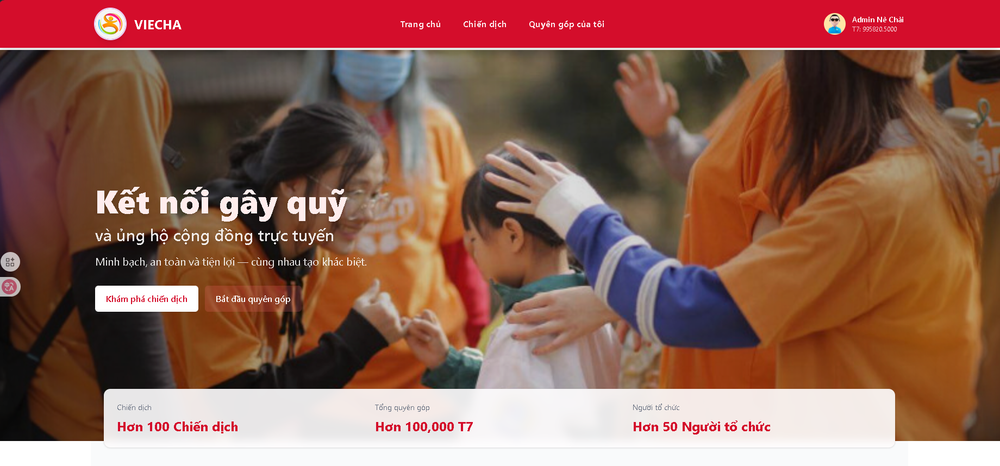

 # VIECHA

VIECHA là nền tảng phi lợi nhuận dựa trên blockchain giúp quản lý, theo dõi và minh bạch hóa các chiến dịch quyên góp. Dự án kết hợp giao diện web thân thiện, hợp đồng thông minh an toàn và API backend để lưu trữ metadata ngoài chuỗi.



**Tính năng nổi bật**
- Tạo và quản lý chiến dịch quyên góp với vai trò người tổ chức.
- Ghi nhận mọi giao dịch quyên góp trực tiếp lên blockchain để đảm bảo tính minh bạch và không thể sửa đổi.
- Phân quyền: người dùng, nhà tổ chức và quản trị viên.
- Frontend hiện đại sử dụng React + Vite, kèm cấu hình kết nối Web3.

**Kiến trúc tổng quan**
- `Client/` — Frontend (React + Vite): giao diện người dùng, xác thực, tạo/duyệt chiến dịch và tương tác Web3.
- `Core/` — Smart contracts (Solidity) và scripts triển khai (Hardhat / ignition). Các artifacts và deployments được lưu trong thư mục `deployments`.
- `Server/` — Backend (Node.js + Express): cung cấp API, xử lý lưu trữ metadata, upload ảnh (Cloudinary) và các tác vụ không hợp lý đưa lên chain.

## Bắt đầu nhanh

Chuẩn bị môi trường:

- Node.js (khuyến nghị v16+)
- npm hoặc pnpm
- Truy cập RPC node (ví dụ: Cronos, Ethereum) và private key để deploy contract (nếu cần)

1) Chạy Frontend

```
cd Client
npm install
npm run dev
```

2) Chạy test / deploy contract (Core)

```
cd Core
npm install
npm run test
# Deploy ví dụ (cần cấu hình .env với RPC + PRIVATE_KEY)
npx hardhat run scripts/deploy-donation.ts --network <network>
```

3) Chạy Backend

```
cd Server
npm install
npm run start    # hoặc npm run dev
```

## Biến môi trường quan trọng

- `RPC_URL`, `PRIVATE_KEY` — cho quá trình deploy và kết nối Web3 (Core và Client khi cần).
- `MONGO_URI` — kết nối database cho `Server` (nếu dùng MongoDB).
- `CLOUDINARY_*` — cấu hình upload ảnh cho backend.

Xem các file `.env.example` (nếu có) trong từng thư mục để biết chi tiết biến môi trường cần thiết.

## Ghi chú cho nhà phát triển

- Địa chỉ và artifacts đã triển khai lưu tại `Core/deployments` và có thể đồng bộ vào `Client` thông qua các file JSON (`Donation.json`, `Team7.json`).
- Frontend sử dụng `src/context` và `src/services/web3` để thiết lập provider và tương tác với contract.

## Đóng góp

- Fork repository → tạo nhánh (`feature/your-feature`) → tạo PR mô tả thay đổi.

